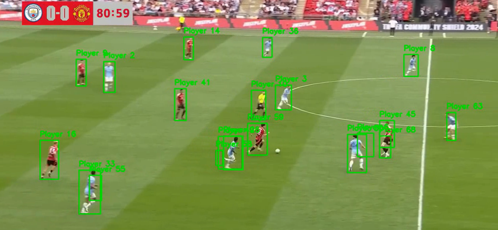

# ⚽ Soccer Player Detection & Tracking

This project is a real-time **soccer player tracker** that detects and tracks players across video frames using:
- **YOLOv8 (custom-trained)**
- **Deep SORT** tracking algorithm

---


## 🔍 What It Does

🎯 Detects objects of interest:
- `Player`
- `Referee`
- `Ball`
- `Goalkeeper`

🎯 Tracks only `players` with unique IDs across the video (you can extend to others).

🎯 Outputs a new video with bounding boxes and labels (`Player 1`, `Player 2`, etc.).

---

## 📁 Folder Structure

```bash
soccer-reid/
├── best.pt                    # Trained YOLOv8 model (download separately, see below)
├── 15sec_input_720p.mp4       # Input video
├── output/
│   └── final_output.mp4       # Final output video with tracking
├── main.py                    # Main working script
├── requirements.txt           # Python dependencies
└── README.md                  # You're reading it!
```

---

## ⚙️ Setup Instructions

Follow these steps to get everything working smoothly:

### 1️⃣ Clone or Download this Project
You can structure the folders manually or clone this repo (if hosted).

---

### 2️⃣ Create and Activate Virtual Environment

```bash
# Windows
python -m venv venv
venv\Scripts\activate

# Mac/Linux
python3 -m venv venv
source venv/bin/activate
```

---

### 3️⃣ Install Requirements

```bash
pip install -r requirements.txt
```

---

### 4️⃣ Download the YOLOv8 Model Weights

Download the `best.pt` file from the following link:

[Download best.pt from Google Drive](https://drive.google.com/file/d/1-5fOSHOSB9UXyP_enOoZNAMScrePVcMD/view)

After downloading, place the `best.pt` file in the root of the `soccer-reid` folder (same location as `main.py`).

---

### 5️⃣ Run the Main Script

```bash
python main.py
```

---

## 📺 Sample Output

The output video with tracked players will be saved as `output/final_output.mp4`.
